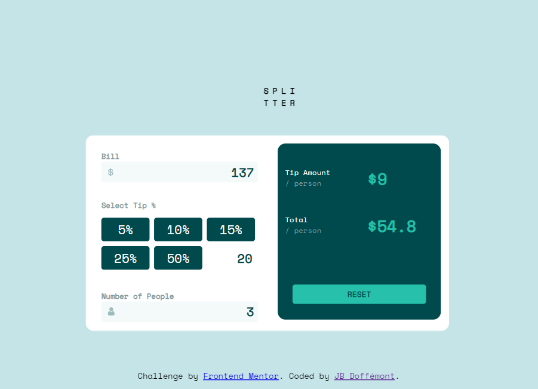
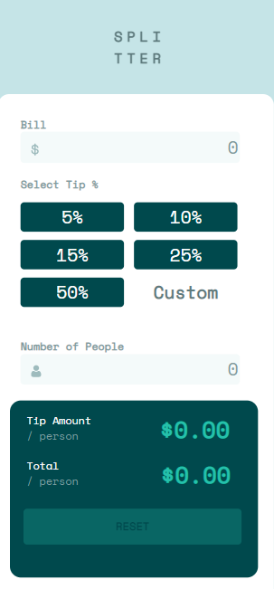

# Frontend Mentor - Tip calculator app solution

## Table of contents

- [The challenge](#the-challenge)
- [Screenshot](#screenshot)
- [Built with](#built-with)
- [What I learned](#what-i-learned)
- [Continued development](#continued-development)
- [Author](#author)

### The challenge

Users should be able to:

- View the optimal layout for the app depending on their device's screen size
- See hover states for all interactive elements on the page
- Calculate the correct tip and total cost of the bill per person

### Screenshots

### Desktop design

### Mobile design

### Links

- Solution URL: [Click here](https://tip-calculator-app-henna.vercel.app/)

### Built with

- Semantic HTML5 markup
- CSS custom properties
- SASS
- JavaScript

### What I learned

My goal on top on succes this challenge in JS was to start using and practice SASS.

### Continued development

I would like to continue praticing SASS on my futur project

## Author

- Website - [JB](https://github.com/JB-Doffemont)
- Frontend Mentor - [@JB-Doffemont](https://www.frontendmentor.io/profile/JB-Doffemont)
